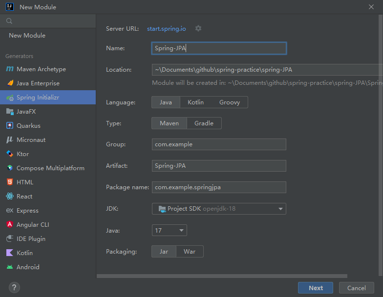
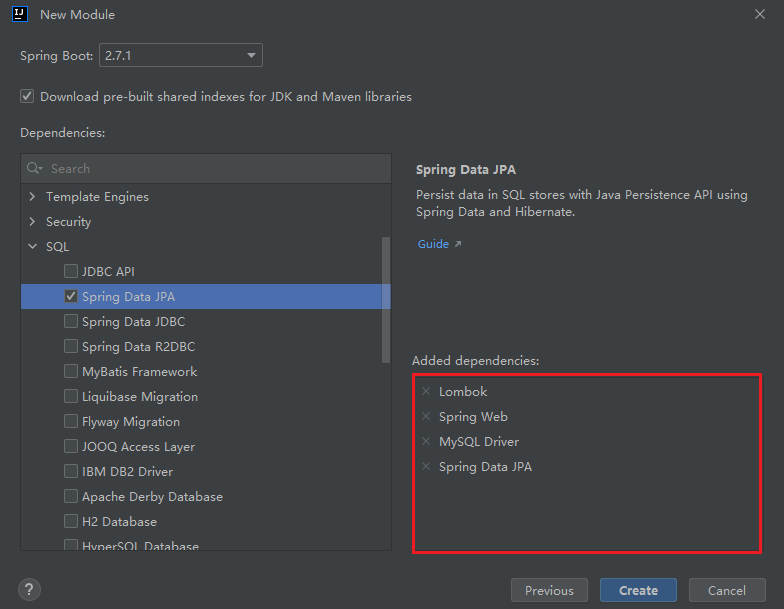
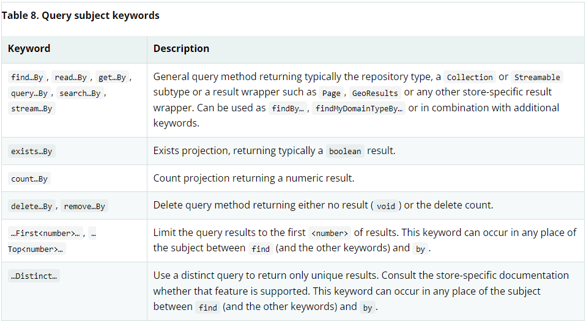

# JPA Practice Note
## create module

## create configuration
create application.yml in folder "resource" 
~~~yaml
spring:
  datasource:
#    database connection configuration
    driver-class-name: com.mysql.cj.jdbc.Driver
    url: jdbc:mysql://localhost:3306/mytestdb
    username: shawnhxf
    password: XXX

  #Statitcs and SQL logs
  jpa:

    show-sql: true   #show sql query command in console
    properties:
      hibernate:
        format_sql: true
        generate_statistics: true
        jdbc:
          batch_size: 10
        order_inserts: true
        order_updates: true
    generate-ddl: true   #generate ddl automatically based on class
    hibernate:
      ddl-auto: update  #update the database when the code is update.

~~~

## create entity class 

- The entity class is the mapping of entities of table in database
- Annotation:
  - @Entity: show it's an entity class  
  - @Table: determine which table is mapped, the content should be the exact table name
  - @Id: set the property of class to be the primary key
  - @Column: mapping to the column of the table and configure the constraint of the column
    - nullable
    - unique
    - length: the max length, equals varchar(XX)
    - columnDefinition: use plain text to set the property
  - @GenerateValue(Strategy=GenerationType.XXX): how to generate the primary key, mostly used is IDENTITY，which means auto_increment
    - IDENTITY: auto_increment
    - AUTO: decide by system automatically
    - SEQUENCE: assign primary keys for the entities using the database sequence.
    - TABLE: assign primary keys for the entities using a database table.
    - 
~~~java
package com.example.springjpa.entity;

import lombok.Data;
import lombok.Getter;
import lombok.Setter;

import javax.persistence.*;
import java.sql.Timestamp;

@Getter
@Setter
@Entity
@Data
@Table(name = "CUSTOMER")  //mapping to table customer in database
public class Customer {

    @Id                          //set custID as primary key
    @Column(name = "custID")
    @GeneratedValue(strategy = GenerationType.IDENTITY)  //set custID as auto_increment
    private long custID;
    
    //set username not null, unique, length<50
    @Column(name="username", nullable = false, unique = true, length=50) 
    private String username;
    
    //set password not null, length<50
    @Column(name="password", nullable = false, length = 50)
    private String password;
    
    //set email length<50
    @Column(name="email", nullable = true, length = 50)
    private String email;
    
    //set crete_time default current_timestamp
    @Column(name="create_time", columnDefinition = "timestamp default current_timestamp")
    private Timestamp createTime;

}

~~~

## create basic repository of customer
- Each entity needs individual repository
- repository can inherit multiple predefined repository because it's an interface

~~~java
package com.example.springjpa.repository;

import org.springframework.data.repository.CrudRepository;

//set parameters to Long because primary key custID is Long, if custID is int, it should be set to Integer here 
public interface CustomerJPARepository extends CrudRepository<Customer, Long> {
}

~~~

## JPQL repository
- JPQL can only define read, update and delete method. It can't define an insert method theoretically. Although it can define an insert method by a complicated way, it's nonsense to do that.
- Annotation:
  - @Query: write the JPQL in this annotation
  - @Transactional: indicates it's a transaction
  - @Modify: indicates it's a query involved change data in database(update or delete)
- parameter indicator:
  - ?number(1,2,3...) means the sequence in parameters list. for example, ?1 means the first parameter in list
  ~~~java
   @Query("FROM Customer WHERE username = ?1")  //"?!" indicates it's the value of the first parameter, i.e. username 
    Customer findCustomerByCustName(String username);
  ~~~
  - :XXX indicate the parameter's name in list, for example, :id indicate it's the parameter named id
  ~~~java
  @Query("update Customer c set c.password=:password where c.custID = :id")  //:id indicates it's the value of parameter "id"
    int updateCustomerPasswordByCustID(String password, Long id);
  ~~~
  
example:

~~~java
package com.example.springjpa.repository;

import org.springframework.data.jpa.repository.Modifying;
import org.springframework.data.jpa.repository.Query;
import org.springframework.data.repository.PagingAndSortingRepository;
import org.springframework.transaction.annotation.Transactional;

public interface CustomerJPQLRepository extends PagingAndSortingRepository<Customer, Long> {

  //read
  //the number followed by question mark represents the position of parameter,1 means first parameter
  @Query("FROM Customer WHERE username = ?1")
  Customer findCustomerByCustName(String username);

  //delete
  @Transactional
  @Modifying
  @Query("delete from Customer where custID = ?1")
  int deleteCustomerByCustID(long custID);

  //update
  //":" is used to mark the parameter name in the method. ":password" means the value is from parameter "password"
  @Transactional
  @Modifying
  @Query("update Customer c set c.password=:password where c.custID = :id")
  int updateCustomerPasswordByCustID(String password, Long id);
}
~~~

## create repository by keyword
- subject keyword

- predicate keywords
<table class="tableblock frame-all grid-all stretch">
<caption class="title">Table 9. Query predicate keywords</caption>
<colgroup>
<col style="width: 25%;">
<col style="width: 75%;">
</colgroup>
<thead>
<tr>
<th class="tableblock halign-left valign-top">Logical keyword</th>
<th class="tableblock halign-left valign-top">Keyword expressions</th>
</tr>
</thead>
<tbody>
<tr>
<td class="tableblock halign-left valign-top">
<code>AND</code>
</td>
<td class="tableblock halign-left valign-top">
<code>And</code>
</td>
</tr>
<tr>
<td class="tableblock halign-left valign-top">
<code>OR</code>
</td>
<td class="tableblock halign-left valign-top">
<code>Or</code>
</td>
</tr>
<tr>
<td class="tableblock halign-left valign-top">
<code>AFTER</code>
</td>
<td class="tableblock halign-left valign-top">
<code>After</code>, <code>IsAfter</code>
</td>
</tr>
<tr>
<td class="tableblock halign-left valign-top">
<code>BEFORE</code>
</td>
<td class="tableblock halign-left valign-top">
<code>Before</code>, <code>IsBefore</code>
</td>
</tr>
<tr>
<td class="tableblock halign-left valign-top">
<code>CONTAINING</code>
</td>
<td class="tableblock halign-left valign-top">
<code>Containing</code>, <code>IsContaining</code>, <code>Contains</code>
</td>
</tr>
<tr>
<td class="tableblock halign-left valign-top">
<code>BETWEEN</code>
</td>
<td class="tableblock halign-left valign-top">
<code>Between</code>, <code>IsBetween</code>
</td>
</tr>
<tr>
<td class="tableblock halign-left valign-top">
<code>ENDING_WITH</code>
</td>
<td class="tableblock halign-left valign-top">
<code>EndingWith</code>, <code>IsEndingWith</code>, <code>EndsWith</code>
</td>
</tr>
<tr>
<td class="tableblock halign-left valign-top">
<code>EXISTS</code>
</td>
<td class="tableblock halign-left valign-top">
<code>Exists</code>
</td>
</tr>
<tr>
<td class="tableblock halign-left valign-top">
<code>FALSE</code>
</td>
<td class="tableblock halign-left valign-top">
<code>False</code>, <code>IsFalse</code>
</td>
</tr>
<tr>
<td class="tableblock halign-left valign-top">
<code>GREATER_THAN</code>
</td>
<td class="tableblock halign-left valign-top">
<code>GreaterThan</code>, <code>IsGreaterThan</code>
</td>
</tr>
<tr>
<td class="tableblock halign-left valign-top">
<code>GREATER_THAN_EQUALS</code>
</td>
<td class="tableblock halign-left valign-top">
<code>GreaterThanEqual</code>, <code>IsGreaterThanEqual</code>
</td>
</tr>
<tr>
<td class="tableblock halign-left valign-top">
<code>IN</code>
</td>
<td class="tableblock halign-left valign-top">
<code>In</code>, <code>IsIn</code>
</td>
</tr>
<tr>
<td class="tableblock halign-left valign-top">
<code>IS</code>
</td>
<td class="tableblock halign-left valign-top">
<code>Is</code>, <code>Equals</code>, (or no keyword)
</td>
</tr>
<tr>
<td class="tableblock halign-left valign-top">
<code>IS_EMPTY</code>
</td>
<td class="tableblock halign-left valign-top">
<code>IsEmpty</code>, <code>Empty</code>
</td>
</tr>
<tr>
<td class="tableblock halign-left valign-top">
<code>IS_NOT_EMPTY</code>
</td>
<td class="tableblock halign-left valign-top">
<code>IsNotEmpty</code>, <code>NotEmpty</code>
</td>
</tr>
<tr>
<td class="tableblock halign-left valign-top">
<code>IS_NOT_NULL</code>
</td>
<td class="tableblock halign-left valign-top">
<code>NotNull</code>, <code>IsNotNull</code>
</td>
</tr>
<tr>
<td class="tableblock halign-left valign-top">
<code>IS_NULL</code>
</td>
<td class="tableblock halign-left valign-top">
<code>Null</code>, <code>IsNull</code>
</td>
</tr>
<tr>
<td class="tableblock halign-left valign-top">
<code>LESS_THAN</code>
</td>
<td class="tableblock halign-left valign-top">
<code>LessThan</code>, <code>IsLessThan</code>
</td>
</tr>
<tr>
<td class="tableblock halign-left valign-top">
<code>LESS_THAN_EQUAL</code>
</td>
<td class="tableblock halign-left valign-top">
<code>LessThanEqual</code>, <code>IsLessThanEqual</code>
</td>
</tr>
<tr>
<td class="tableblock halign-left valign-top">
<code>LIKE</code>
</td>
<td class="tableblock halign-left valign-top">
<code>Like</code>, <code>IsLike</code>
</td>
</tr>
<tr>
<td class="tableblock halign-left valign-top">
<code>NEAR</code>
</td>
<td class="tableblock halign-left valign-top">
<code>Near</code>, <code>IsNear</code>
</td>
</tr>
<tr>
<td class="tableblock halign-left valign-top">
<code>NOT</code>
</td>
<td class="tableblock halign-left valign-top">
<code>Not</code>, <code>IsNot</code>
</td>
</tr>
<tr>
<td class="tableblock halign-left valign-top">
<code>NOT_IN</code>
</td>
<td class="tableblock halign-left valign-top">
<code>NotIn</code>, <code>IsNotIn</code>
</td>
</tr>
<tr>
<td class="tableblock halign-left valign-top">
<code>NOT_LIKE</code>
</td>
<td class="tableblock halign-left valign-top">
<code>NotLike</code>, <code>IsNotLike</code>
</td>
</tr>
<tr>
<td class="tableblock halign-left valign-top">
<code>REGEX</code>
</td>
<td class="tableblock halign-left valign-top">
<code>Regex</code>, <code>MatchesRegex</code>, <code>Matches</code>
</td>
</tr>
<tr>
<td class="tableblock halign-left valign-top">
<code>STARTING_WITH</code>
</td>
<td class="tableblock halign-left valign-top">
<code>StartingWith</code>, <code>IsStartingWith</code>, <code>StartsWith</code>
</td>
</tr>
<tr>
<td class="tableblock halign-left valign-top">
<code>TRUE</code>
</td>
<td class="tableblock halign-left valign-top">
<code>True</code>, <code>IsTrue</code>
</td>
</tr>
<tr>
<td class="tableblock halign-left valign-top">
<code>WITHIN</code>
</td>
<td class="tableblock halign-left valign-top">
<code>Within</code>, <code>IsWithin</code>
</td>
</tr>
</tbody>
</table>

## Tips
- if you don't want using Optional<T>, you can define the method with the entity class in repository
~~~java
public interface UserRepository extends PagingAndSortingRepository<User, Long> {

    User findUserByUid(long uid);
}
~~~
In this example,  if we leave blank, the return data type will be Optional<User> by method of findById(), the it's a little hard to convert Optional<User> to User. But we can define the method with 
User class so that we can make the return data type to User class, and then we can use User.getXXX to get the value directly.
~~~java
 public void customerTest(){
        User record = repository.findUserByUid(2L);
        System.out.println(record.getCustName());
    }
~~~